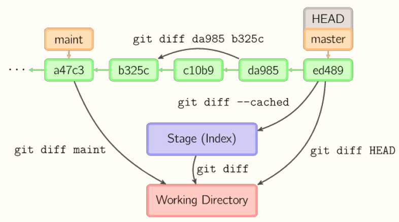
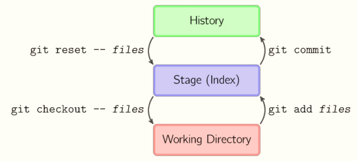
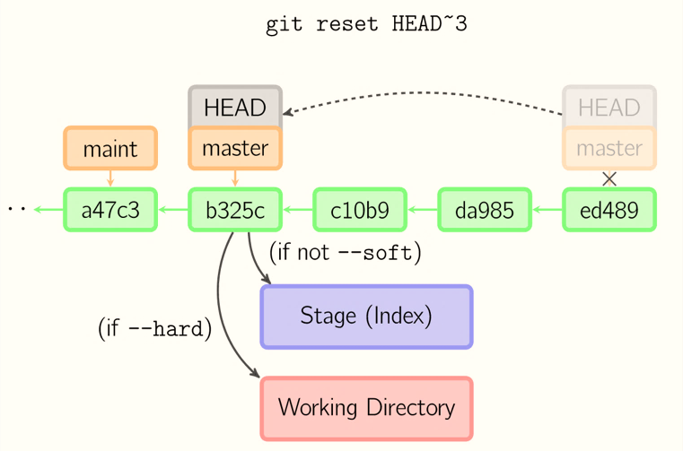

## GIT 使用
-	配置命令
>> 1.显示当前的 Git 配置

>> ```git config --list```

>> 2.设置提交仓库时的用户名信息

>> ```git config --global user.name “your name”```

>> 3.设置提交仓库时的邮箱信息

>> ```git config --global user.email “408542507@qq.com”```

> 提交时转换为LF，检出时转换为CRLF，默认设置不用修改

>>``` git config –-global core.autocrlf true```

> 允许提交包含混合换行符的文件

>> ```git config –-global core.safecrlf false```

> 存储凭证

```git config –-global credential.helper wincred
```

-	在当前目录新建一个 Git 代码库
>> ```git init```

-	下载一个项目和它的整个代码历史

 >>url 格式: https://github.com/[userName]/reposName
 
>> ```git clone [url]```

- 添加删除文件

>> 添加指定文件到暂存区

>> ```git add [file1] [file2]```

>> 删除工作区文件，并且将这次删除放入暂存区

>> ```git rm [file1] [file2]```

>>  改名文件，并且将这个改名放入暂存区

>> ```git mv [file-origin] [file-renamed]```


- 查看信息

> 显示变更信息

```git status```

> 显示当前分支的历史版本

```
git log
git log --oneline
```

>以图形的方式打印 Git 提交日志
```
git log –pretty=format:’%h %ad | %s%d’ –graph –date=short
```

> short and branch

```git status -sb```

> 查看某个提交信息
```git show HEAD```

> 查看提交历史
```git log <file name>
git log --grep <msg>
git log -n
```


- 同步远程仓库

> 增加远程仓库，并命名

``` git remote add [shortname] [url] ```

> 将本地的提交推送到远程仓库

```
git push [remote] [branch]
```
> 将远程仓库的提交拉下到本地

```git pull [remote] [branch]```

- .gitignore

> 强制添加 .gitignore 忽略的文件

```git add –f <file name>```

> 查看 .gitignore 策略生效行号

``` git check-ignore –v <file name>```

- 协议

> 克隆本地仓库

```git clone /c/wd/test.git```

> 克隆本地仓库，不建议使用 file:// 

```git clone file:///c/wd/test.git```

> 添加远程仓库的链接

``` git remote add origin /c/wd/test.git```

- 克隆远程仓库

```git clone git://server_ip/test.git```

- 添加远程仓库的链接

```git remote add origin git://server_ip/test.git```

- 生成 RSA 密钥对

```ssh-Keygen -t rsa -C "your email"```


- 逐行查看文件的修改历史
```
git blame <file name>

从第 100 行开始，到 110 行。逐行查看文件的修改历史
git blame –L 100,110 <file name>
```
### 文件提交

- 每个提交要保证适当的颗粒度、相关性和独立性。

>>提交暂存区到仓库

 ```shell
git commit –m [message]  
git commit –a –m [message]
```

### DIFF



### 回撤操作

- 回撤暂存区内容到工作目录
```git reset HEAD```

- 回撤提交到暂存区
```git reset HEAD --soft```

- 回撤提交，放弃变更
```git reset HEAD –-hard```

- 回撤远程仓库，-f  即 --force
```git push -f```



- 变基操作，改写历史提交

```git rebase –i HEAD~3```

### 标签

- 在当前提交上，打标签 foo

```git tag foo ```

- 在当前提交上，打标签 foo，并给 message 信息注释

```git tag foo –m “message”```

- 在当前提交之前的第 4 个版本上，打标签 foo

```git tag foo HEAD~4```

- 列出所有标签

```git tag```

- 删除标签

```git tag –d foo```

- 把标签推送到远程仓库

```git push origin --tags```

- 把标签推送到远程仓库

```git push origin v0.1```

## 分支

- 创建分支 foo

```git branch foo   ```
    
- 切换到分支 foo

```git checkout foo```

- 创建分支并同时切换到 foo，一步做到

```git checkout -b foo```


- 修改分支名字

```
git branch –m old_name new_name
git branch –M old_name new_name   
```

- 删除分支 foo

```
git branch -d foo
Git branch –D foo
```
- 列出远程分支

```git branch -r
```

- 查看已合并的分支

```git branch --merged
git branch --no-merged
 ```
 
- 列出远程合并的分支

```
git branch -r --merged
```

- 取出远程 foo 分支

```
git checkout –t origin/foo
```

- 删除远程分支
```
git push origin <space>:<remote branch>
git fetch -p
   ```· 
   
- 合并分支

```git merge <branch name>```

- 合并分支，拒绝 fast forward，产生合并 commit

```git merge –-no-ff```

### Git stash

-  保存进度

```git stash```
    
- 弹出进度

```git stash pop```

- 查看 stash 列表

```
git stash list
```

- 删除 stash 列表

```
git stash clear
```

## 资源

- https://github.com/wangding/courses
- http://www.ruanyifeng.com/blog/2016/01/commit_message_change_log.html
